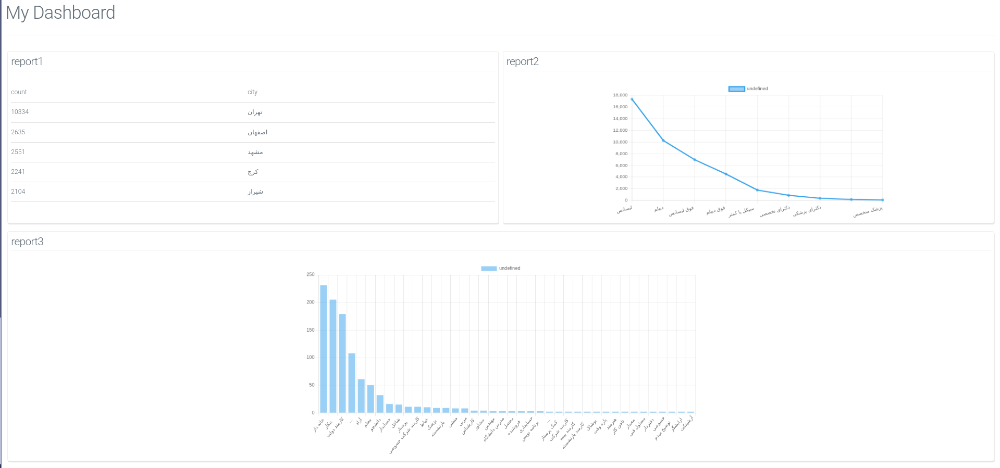

# Data Analytics For Developers (DAD)

make your custom dashboards just with api endpoints!



## Get started

1. clone DAD source

2. create `.env` file based on `.env.example` file

> most important properties that you must fill is `DS_TYPES`

> if you want to use another database like `mysql` for internal, you must add right package in `package.json` file as follows:
> - for mysql: `"mysql2":"^2.3.0"`

3. now `npm i` to install dependencies

4. then run DAD with `npm run build; npm run start`

5. you must call an API for install and configure DAD:

```
[GET] http://localhost:8082/api/v1/server/install
```

## Documentation

- after, install DAD, you can access to swagger API docs.
- [Configs](./docs/configs.md)
## TODO

- [x] using pipes
- [ ] complete simple dashboard
- [ ] cache report queries
- [ ] using ORM language (with loops and variables)